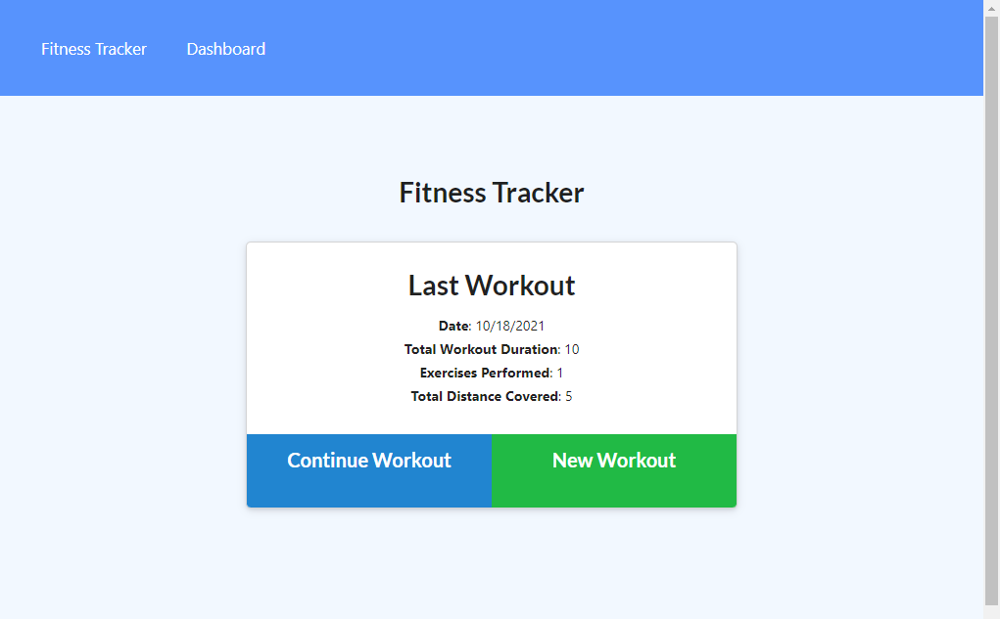
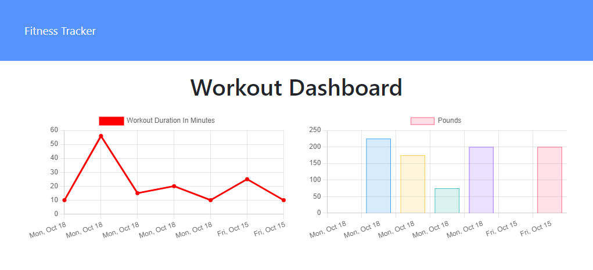

<h1 align="center">Workout Tracker</h1>
<h2 align="center">MongoDB</h2>

## Description

This application allows a user to track their workout progress. Workouts consist of one or more exercises that the user can record. Data is persisted by a MongoDB backend. The application is deployed to Heroku and can be found here: [Workout Tracker](https://warm-gorge-51596.herokuapp.com/)

## Table of Contents

- [Usage](#usage)
- [License](#license)
- [How to Contribute](#how-to-contribute)
- [Questions](#questions)

## Usage

[Workout Tracker](https://warm-gorge-51596.herokuapp.com/)

The homepage of the application will present details of the most recent workout to the user, allowing them to continue adding exercises to that workout. If no workouts have been started or the user wishes to start a new workout, they may do so. In either case, the user is given the option to record one or more exercises to associate with the current workout. There is also a "Dashboard" navigation option that allows the user to view charts that provide a visual summarization of their 7 most recent workouts.

## License

This application is covered under the MIT license. Information about this license can be found [here](http://choosealicense.com/licenses/mit/).

## How to Contribute

[MichaelHermes](https://github.com/MichaelHermes)

## Questions?

Find me on [Github](https://github.com/MichaelHermes) or email me at [mikehermes87@gmail.com](mailto:mikehermes87@gmail.com).
